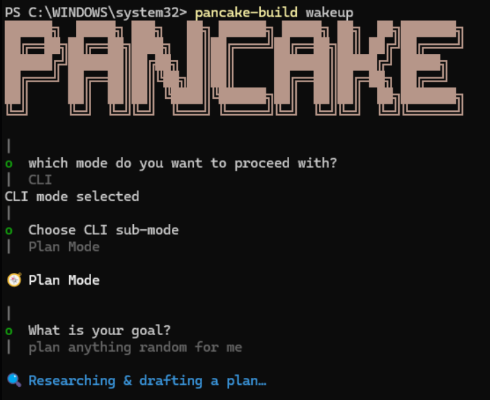
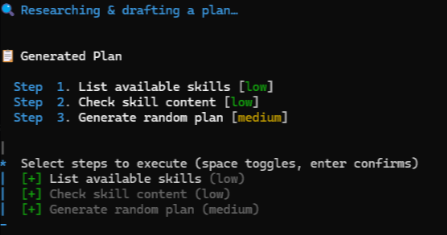
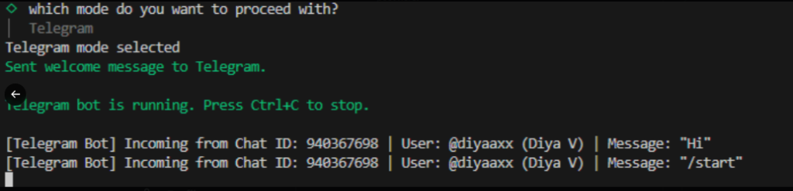
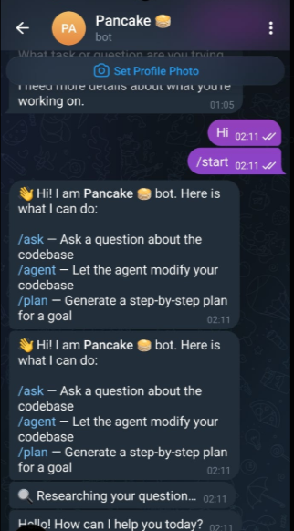

# 🥞 Pancake

Pancake is a agentic coding assistant and search subsystem. Built entirely using modern TypeScript and optimized for **Bun**, Pancake empowers you with a  conversational and a  codebase companion accessible through a CLI Terminal UI or a Telegram bot.


## Features

###  1. Terminal UI (`TUI`)
Run `pancake-build wakeup` to view the banner and select your preferred operational mode:
* **  Ask Mode** — Ask complex questions about your codebase or the web. Pancake analyzes your files and pulls real-time information to synthesize detailed answers (with the option to instantly save answers as local `.md` docs).
* ** Agent Mode** — Provide a goal and let it write, modify, or delete files, staging every change before you apply them.
* ** Plan Mode** — Generate sequential execution steps for complex requirements, review and select/toggle specific milestones, and execute them step-by-step with safety staging.

<p align="center">
  
  
</p>

###  2.  Telegram Bot  (`minipancake_bot`)
Interact with your codebase and control tasks remotely via a Telegram bot client:
* **Remote Assistant** — Use standard commands like `/ask`, `/agent`, and `/plan` directly from your mobile or desktop Telegram application.
* **Real-time Server logs** — Monitor bot operations, session initialization, and incoming messages straight from your host terminal.

<p align="center">
  
  
</p>

### Getting Started

###  Prerequisites
* **[Bun](https://bun.sh/)** v1.3.0 or higher.


### ⚙️ Environment Configuration (`.env`)
Create a `.env` file in the root of your workspace:
```env
# OpenRouter Configuration
OPENROUTER_API_KEY=your-openrouter-api-key
OPENROUTER_DEFAULT_MODEL='openrouter/free'

# Telegram Integration
TELEGRAM_BOT_TOKEN=your-telegram-bot-token
TELEGRAM_OWNER_ID=your-numeric-telegram-chat-id
```

###  Installation
Install standard dependencies inside your workspace:
```bash
bun install
```

### Launching Pancake
To boot Pancake and enter the interactive menu, simply run the custom package binary:
```powershell
pancake-build wakeup
```
Select **CLI** to run inside your terminal, or **Telegram** to boot the live bot server and control your machine remotely.

---

## 🛠️ Codebase Structure

```text
├── 📂 ai/                # AI client & OpenRouter model configurations
├── 📂 modes/             # Operational mode entry points
│   ├── 📂 agent/         # File staging, action tracker, and tool definitions
│   ├── 📂 ask/           # Q&A orchestrator with saving features
│   ├── 📂 plan/          # Planning parser and step selection logic
│   └── 📂 telegram/      # Telegram bot server, session handlers & message formatting
├── 📂 tools/             
│   └── 📂 web/           # DuckDuckGo Lite search engine and Cheerios scraper
├── 📂 tui/               # Terminal markdown rendering and startup selector menus
└── 📄 index.ts           # Global Bun entry point with environment polyfills
```

---

## 🤝 Technical Highlights
* **Bun compatibility layer**: Pancake patches native `Error.prototype.message` to support Telegraf's network error token redactors under Bun's read-only environment constraints.
* **Graceful API Fallbacks**: Integrates dynamic try-catch formatting loops on message delivery—if Telegram's parser errors due to unescaped Markdown code tags, Pancake silently drops formatting and delivers as plain text, ensuring zero delivery crashes.
* **Isolated Overlay Sandbox**: Changes staged by the agent do not affect live codebase files until you explicitly trigger the `Implement` callback, creating an exceptionally safe development boundary.

---

